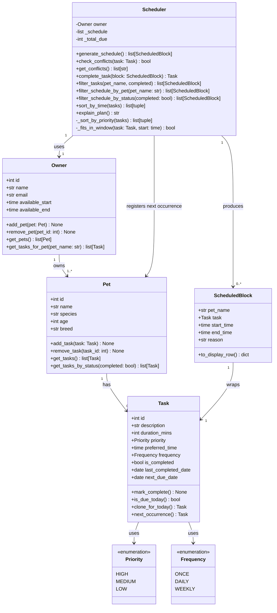

# PawPal+ (Module 2 Project)

You are building **PawPal+**, a Streamlit app that helps a pet owner plan care tasks for their pet.

## Scenario

A busy pet owner needs help staying consistent with pet care. They want an assistant that can:

- Track pet care tasks (walks, feeding, meds, enrichment, grooming, etc.)
- Consider constraints (time available, priority, owner preferences)
- Produce a daily plan and explain why it chose that plan

Your job is to design the system first (UML), then implement the logic in Python, then connect it to the Streamlit UI.

## What you will build

Your final app should:

- Let a user enter basic owner + pet info
- Let a user add/edit tasks (duration + priority at minimum)
- Generate a daily schedule/plan based on constraints and priorities
- Display the plan clearly (and ideally explain the reasoning)
- Include tests for the most important scheduling behaviors

## Demo

<a href="/course_images/ai110/final_pawpal_demo.png" target="_blank"></a>

## UML Design



## Features

### Scheduling
- **Priority-based scheduling** — Tasks are ordered HIGH → MEDIUM → LOW. A HIGH task always claims a time slot before any MEDIUM or LOW task, regardless of the order they were added.
- **Soft preferred-time constraint** — Tasks with a `preferred_time` are delayed to that time if the current slot is earlier. A 6 PM feeding won't be packed in at 8 AM just because a slot is open.
- **Owner availability window** — Every task must finish before `available_end`. Tasks that would overflow the window are skipped and counted in the summary.
- **Three-level tie-breaking** — Among tasks of equal priority, the scheduler applies: (1) earlier preferred time first, (2) shorter duration first. Tasks with no preferred time sort last within their group.

### Recurrence
- **Daily and weekly tasks** — Tasks set to `DAILY` or `WEEKLY` frequency are cloned before scheduling so that completing a scheduled copy never mutates the original task on the pet.
- **Next-occurrence tracking** — Completing a task via `complete_task()` automatically creates the next instance with `next_due_date` set: +1 day for `DAILY`, +7 days for `WEEKLY`. The new task is registered directly on the pet.
- **Smart due-date gating** — `is_due_today()` checks `next_due_date` for recurring tasks. A task with `next_due_date = None` (never run) is always treated as due immediately.

### Conflict Detection
- **Automatic conflict scan** — `get_conflicts()` scans the full schedule for overlapping time blocks across all pets. Uses a sort + single linear pass (O(n log n + n)) instead of a nested loop (O(n²)).
- **Human-readable warnings** — Each conflict produces a message naming both tasks, their pets, and the overlapping time range.
- **Back-to-back safety** — Tasks that end exactly when the next one starts are not flagged as conflicts.

### Filtering & Sorting
- **Filter by status** — `filter_tasks(completed=True/False)` returns only completed or incomplete blocks from the current schedule.
- **Filter by pet** — `filter_schedule_by_pet(pet_name)` returns all scheduled blocks for a specific pet (case-insensitive).
- **Sort by time** — `sort_by_time()` reorders any task list by `preferred_time` ascending, with unscheduled tasks placed last. Useful for viewing tasks in the order they will happen rather than by priority.

### Streamlit UI
- **Persistent session state** — Owner, pet, and scheduler objects live in `st.session_state` and survive page reruns. Adding a task does not reset the owner or schedule.
- **Color-coded priority badges** — HIGH (🔴), MEDIUM (🟡), LOW (🟢) in the task table.
- **Live task metrics** — Total tasks, high-priority count, and completed count update as tasks are added.
- **Schedule summary metrics** — After generating, displays tasks scheduled, total due, and skipped count at a glance.
- **Conflict warnings in the UI** — If overlapping blocks are detected, an error banner appears with each conflict described and advice on how to resolve it.
- **Filterable schedule view** — A filter panel appears after schedule generation to show All, Incomplete, or Completed blocks.
- **Plan explanation** — An expandable "Why this order?" section shows the plain-English reasoning behind the generated schedule.

## Smarter Scheduling

Several enhancements were made to the core scheduling logic beyond the original design:

**Preferred time as a soft constraint** — Tasks with a `preferred_time` are no longer just sorted by that value; the scheduler now delays a task's actual start slot to its preferred time if the current slot is earlier. A feeding task set for 6 PM won't be packed in at 8 AM just because a slot is open.

**Recurring task cloning** — `DAILY` and `WEEKLY` tasks are cloned before being placed in the schedule so that calling `mark_complete()` on a scheduled block never mutates the original task on the pet.

**Accurate next-occurrence dates** — When a recurring task is completed via `Scheduler.complete_task()`, the next occurrence is created with `next_due_date` set using `timedelta`: +1 day for `DAILY`, +7 days for `WEEKLY`. `is_due_today()` gates on this date instead of always returning `True` for daily tasks.

**Filtering** — Three new methods let you slice the schedule without re-generating it:
- `filter_tasks(pet_name, completed)` — filter by pet, status, or both
- `filter_schedule_by_pet(pet_name)` — blocks for one pet
- `filter_schedule_by_status(completed)` — pending or done blocks only

**Chronological sort** — `sort_by_time()` sorts any task list by `preferred_time` ascending, with unscheduled tasks placed last. Useful for displaying tasks in the order the owner will do them rather than by priority.

**Conflict detection** — `get_conflicts()` scans the built schedule for overlapping blocks across all pets and returns a plain-English warning per conflict. Uses a sort + single linear pass (O(n log n)) instead of a nested loop (O(n²)), with direct `time` comparison so no `datetime` conversion is needed.

## Testing PawPal+

The test suite lives in `tests/test_pawpal.py` and covers three core areas.

### Running the tests

```bash
source .venv/bin/activate  # Windows: .venv\Scripts\activate
pytest tests/test_pawpal.py -v
python3 -m pytest # For MacOS, use to get all tests to pass with green checkmarks in terminal
```

### What is tested

**Sorting correctness**
Verifies that `generate_schedule` always returns tasks in HIGH → MEDIUM → LOW priority order, that equal-priority tasks are tie-broken by shorter duration first, and that a pet with no tasks produces an empty schedule without errors.

**Recurrence logic**
Confirms that completing a `DAILY` task via `Scheduler.complete_task()` registers a new task on the pet with `next_due_date` set to tomorrow, that the new task starts incomplete, and that `ONCE` tasks return `None` with no follow-up queued. Also verifies that a task with `next_due_date=None` (never run) is treated as due immediately.

**Conflict detection**
Checks that a normally generated schedule is conflict-free, that manually injected overlapping blocks are flagged with a human-readable warning naming both tasks, that back-to-back tasks (end time == next start time) are not reported as conflicts, and that a single-block schedule never conflicts with itself.

### Test count

| Group | Tests |
|---|---|
| Sorting correctness | 4 |
| Recurrence logic | 4 |
| Conflict detection | 4 |
| Task / Pet fundamentals (existing) | 5 |
| **Total** | **17** |

### Confidence Level

**3.5 / 5 stars** — Core scheduling behaviors (priority ordering, recurrence,
conflict detection) are well-tested. Gaps remain in multi-pet scheduling,
preferred-time constraints, window overflow, and filter methods.

## Getting started

### Setup

```bash
python -m venv .venv
source .venv/bin/activate  # Windows: .venv\Scripts\activate
pip install -r requirements.txt
```

### Suggested workflow

1. Read the scenario carefully and identify requirements and edge cases.
2. Draft a UML diagram (classes, attributes, methods, relationships).
3. Convert UML into Python class stubs (no logic yet).
4. Implement scheduling logic in small increments.
5. Add tests to verify key behaviors.
6. Connect your logic to the Streamlit UI in `app.py`.
7. Refine UML so it matches what you actually built.
