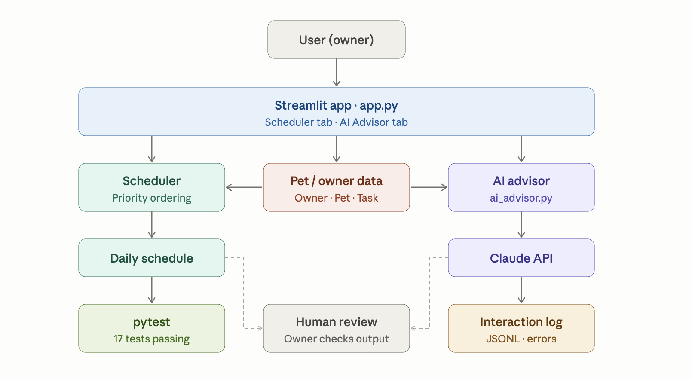

# PawPal+ Applied AI System

**Base project:** PawPal+ (Module 2) — A priority-based pet care scheduler built with Python and Streamlit.

PawPal+ originally helped pet owners manage daily care tasks by generating a priority-ordered, conflict-free schedule. This version evolves that prototype into a full applied AI system by adding a context-aware AI advisor powered by structured logging, and a complete test suite — turning a scheduling tool into an intelligent pet care assistant.

---

## What this project does

PawPal+ helps busy pet owners stay consistent with their pet's care. It combines a rule-based scheduler with an AI advisor that reads your pet's profile and current task list, then gives personalized, actionable recommendations in real time.

**Why it matters:** Pet care is easy to forget or deprioritize. PawPal+ removes the guesswork by both organizing tasks intelligently and giving owners AI guidance tailored to their specific animal.

---

## System architecture



The system has three layers:

**Data layer** — `Owner`, `Pet`, `Task`, and `ScheduledBlock` dataclasses in `pawpal_system.py` hold all session state.

**Logic layer** — The `Scheduler` class generates a priority-ordered, conflict-free daily plan. The `ai_advisor.py` module passes live pet context to Claude and returns structured task suggestions.

**UI layer** — `app.py` connects everything in a two-tab Streamlit interface: the Scheduler tab for managing tasks and the AI Advisor tab for chat-based pet care guidance.

Data flows: user input → pet/owner objects → scheduler generates plan → AI advisor reads context → Claude returns suggestions → user sees results in UI. Every AI interaction is logged automatically.

---

## AI feature: Agentic Workflow

The AI Advisor is an agentic workflow because it does not answer generic questions — it reads the live state of the app and reasons about what is needed for that specific pet.

When a user submits a message, the system automatically:

1. Gathers the current pet's name, species, and scheduled task list from session state
2. Passes that context to Claude as a structured system prompt
3. Claude reasons about what care tasks are missing or recommended for that animal
4. Returns structured suggestions in a consistent format: `Task: [name] | Duration: [X] mins | Priority: [HIGH/MEDIUM/LOW]`
5. Logs every interaction to `logs/pawpal_ai_log.jsonl` with timestamp, context, and success status

The AI's output is shaped by the pet's real data — not a generic prompt — making it genuinely context-aware rather than just a chatbot.

---

## Setup instructions

### 1. Clone the repo

```bash
git clone https://github.com/Martinljuljduraj/applied-ai-system.git
cd applied-ai-system
```

### 2. Create and activate a virtual environment

```bash
python3 -m venv .venv
source .venv/bin/activate
```

On Windows:
```bash
.venv\Scripts\activate
```

### 3. Install dependencies

```bash
pip install -r requirements.txt
```

### 4. Add your Anthropic API key

Create a `.env` file in the project root:

```
ANTHROPIC_API_KEY=your-api-key-here
```

Get a key at [console.anthropic.com](https://console.anthropic.com). A small amount of credits ($5) is required — this project uses a negligible fraction of that.

### 5. Run the app

```bash
streamlit run app.py
```

---

## Sample interactions

**Input:** "What daily tasks should I add for my dog Zoe?"

**Output:**
```
Task: Feeding | Duration: 10 mins | Priority: HIGH
Task: Fresh Water Refill | Duration: 5 mins | Priority: HIGH
Task: Evening Walk | Duration: 20 mins | Priority: HIGH
Task: Playtime | Duration: 15 mins | Priority: MEDIUM
Task: Dental Care | Duration: 5 mins | Priority: MEDIUM
```

**Input:** "How often should I brush a Labrador?"

**Output:** The AI explains brushing frequency based on breed and coat type, and suggests a task to add to the schedule.

**Input:** "My cat seems lethargic — what should I watch for?"

**Output:** The AI outlines behavioral signs to monitor and recommends scheduling a vet check task at HIGH priority.

---

## Reliability and logging

Every AI interaction is automatically logged to `logs/pawpal_ai_log.jsonl` with the following fields: timestamp, pet context, user message, AI response, and success status. All errors are caught and return a safe message to the user instead of crashing the app.

The scheduler has 17 passing unit tests covering priority ordering, recurrence logic, and conflict detection:

```bash
python3 -m pytest tests/test_pawpal.py -v
```

---

## Design decisions

**Why Claude over a rules-based suggestion engine?** A rules-based system would require manually maintaining a database of species-specific care guidelines. Claude already has that knowledge and can reason across species, breeds, ages, and edge cases without any maintenance.

**Why log to JSONL?** Each interaction is a self-contained JSON object on its own line, making it easy to parse, filter, or feed into an evaluation script without loading the entire file.

**Why keep the scheduler rule-based?** The scheduling logic — priority ordering, conflict detection, recurrence — is deterministic and well-tested. Replacing it with AI would make behavior unpredictable and harder to verify. The two systems complement each other: rules for structure, AI for guidance.

**Why not store chat history across sessions?** The AI advisor is designed for in-session guidance rather than long-term memory. Each session starts fresh so the owner can get advice for whichever pet they set up that day.

---

## Testing summary

All 17 scheduler unit tests pass. The AI advisor handles errors gracefully — when the API is unavailable or returns an error, the app displays a safe fallback message instead of crashing, and the failure is logged with full context. Edge cases tested include empty task lists, missing pet context, and API authentication failures.

See `model_card.md` for full testing results and reliability details.

---

## Demo walkthrough

[Loom video link — add before submission]

---

## Reflection and ethics

See `model_card.md` for the full reflection covering limitations, potential misuse, testing surprises, and AI collaboration notes.

---

## Project evolution

This project evolved from PawPal+ (Module 2), which was a pure Python scheduling app with no AI. The original goals were to track pet care tasks, apply priority-based scheduling, and detect scheduling conflicts. This version keeps all of that and adds a live AI advisor that makes the system genuinely intelligent rather than just organized. The addition of structured logging and a test suite also brings the project to a professional standard where someone else could clone and run it without guessing what to install or how it behaves.
